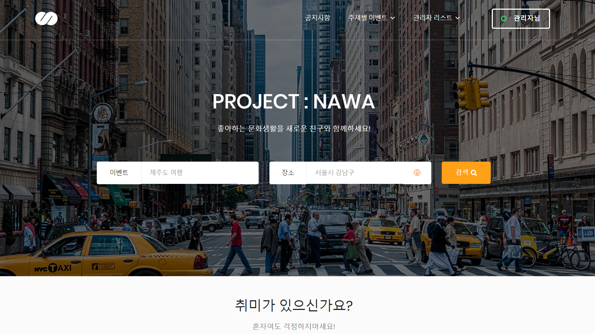

### Nawa: 모임 중개 서비스

## 개요
가끔 혼자서는 조금 외로웠던 취미 생활이 있으셨나요?
그 아름다운 순간들을 누군가와 함께하고 싶었던 순간들이 있지 않았을까요?
저희 '나와'에서는 그런 순간들을 위해 멋진 동료를 찾아드리는 서비스를 제공하고 있습니다.

## 설치 및 실행 방법
> [demo](https://naw.kr)
> 이 프로젝트는 개발이 중단되어 일부 미완성 기능을 포함하고 있습니다. 
> 데모 서비스 호스팅은 현재 지원되지 않습니다.

## 주요 기능
- 원하는 취미의 이벤트를 검색한다.
- 이벤트를 직접 개설한다.
- 모집중인 이벤트에 참가한다.
- 참가했던 이벤트의 후기를 공유한다.
- 이벤트에 관해 문의한다.

## 기술 스택
- **언어**
  - JSP
  - Java
  - Javascript
  - HTML/CSS
  - SQL
- **서버**
  - Tomcat
- **프레임워크**
  - Spring Framework
  - MyBatis
- **API, Library**
  - Google Login API
  - kakao Login API
  - kakao Maps API
  - Maven
  - Jackson
  - commons-fileupload
  - commons-io
  - javax.mail
  - Spring Social
  - Spring Scheduler
  - Spring Security
  - Spring-AOP
  - Gson
- **데이터베이스**
  - MariaDB
- **IDE**
  - Eclipse

## 라이선스
Copyright © 2019. [EGO CREW](https://ego.so/). All rights reserved.